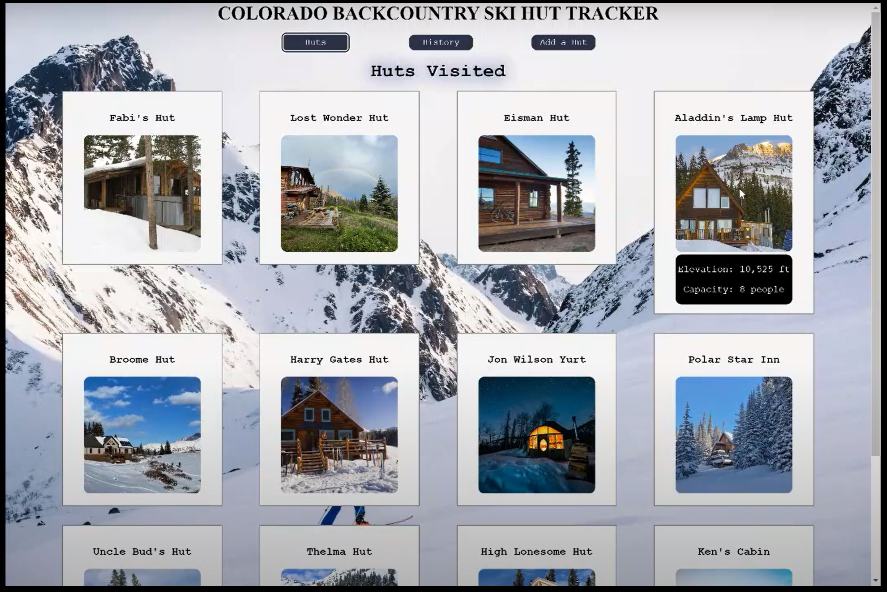

# Colorado Backcounty Ski Hut Tracker

Colorado Backcounty Ski Hut Tracker is a Single Page Application (SPA) that allows the user to keep track of the huts they have visited. The user can add new huts through a form. The application also includes a bit of history on backcounty ski huts in Colorado.

## How It Works

Colorado Backcounty Ski Hut Tracker will add any hut that you can submit the following information for: name, elevation, capacity, and image. If this information is known, a hut can be added to the database and added to the Colorado Backcounty Ski Hut Tracker Application.

### Video Walkthrough

## Installation

Fork and clone a copy of the repository  
Run the server using the command json-server --watch db.json
Start the react application with npm start
You are good to go!

## Usage
The user is able to see all the huts they have entered when the page first loads.

To see the details of a specific hut, they can hover their mouse over the card of a hut. When their mouse is over the hut, the hut card will display the hut elevation and capacity.

To enter a new hut, the user needs to select "Add Hut" from the navigation bar. The user will need to enter the Hut Name, Hut Elevation, Hut Capacity, and add an image. 

Once the user presses the submit button, the hut will be added to the Huts page.

If the user accidentally goes to a url that does not exist in the application, the site will display an error page notifying the user that they are on a page that doesn't exist.

## Credits
Hut information: <a href="https://www.huttripper.com/">HutTripper</a>